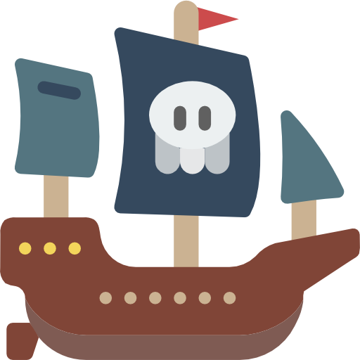
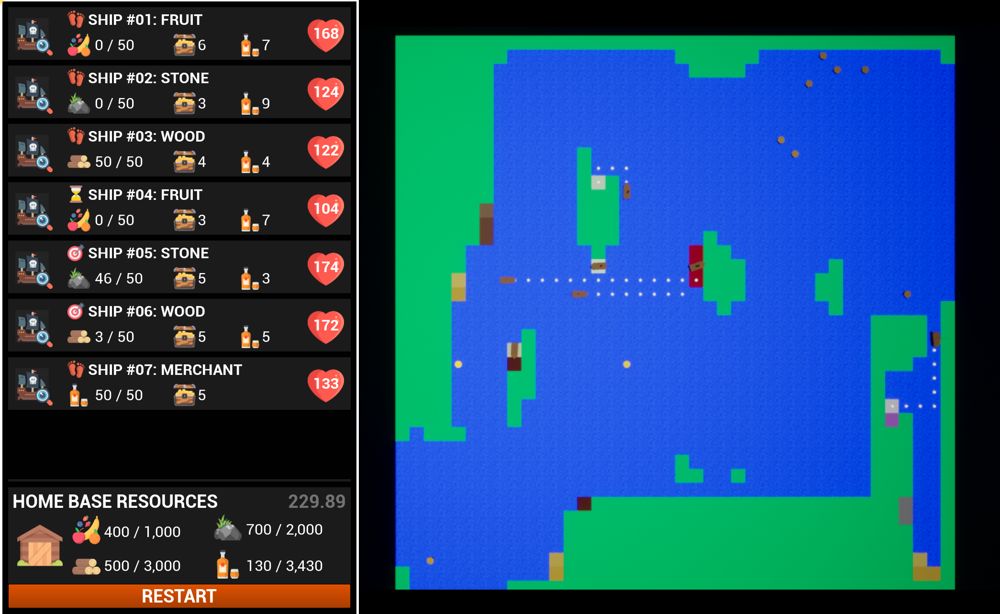
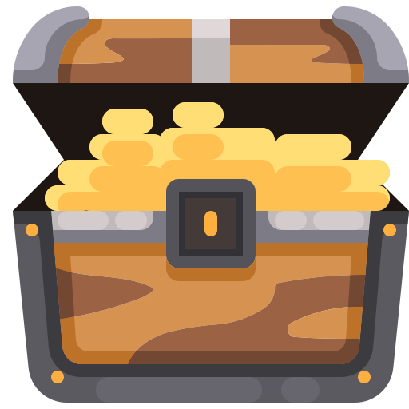

# Artificial Life - Goals Assignment 

**Harrison Verrios**

25 April 2022


## Installation
**Unreal Version:** 4.27<br>
**Devices:** Windows / Mac

Running the Unreal application on any valid device will result with the following output when the *Play* button is clicked:



---

## Brief

>The pirate ships (agents) must collect resources from surrounding islands to build up their home island within the virtual environment. There are 3 types of pirate ship, each assigned a different resource to collect: wood, stone or fruit. Each pirate ship must navigate the world and collect resources from surrounding islands, whilst ensuring they avoid collisions with other ships. Pirate ships start with 100 morale points. This total decreases by 1 point for each action taken, such as moving 1 tile or collecting a resource. When morale reaches 0 points a mutiny occurs! The pirate ship stops all actions for the remainder of the simulation. Pirate ships can collect treasure to refresh their morale. Your task is to implement a planning system for completing sequences of actions to ensure the pirate ships collect resources required for the home island whilst managing their individual morale. As part of this, the ships should not collide with other ships. This may require you to implement changes to the path finding algorithm.

---

## Resources

There are 4 resources in this application; fruit, stone, wood and rum. The first three resources are searched by 2 agents each, and each ship aims to collect 50 resources from a specific location and deposits them back to one of the three home-base locations. Once deposited, they will return back to another resource location that still contains a resource and collect more. Each resource tile has a maximum of 500 resources of it's chosen type. As resources are used up, the colour of the tiles slowly fade to white.

### Fruit 
>Fruit can be found on the **pink** tiles. There are only 2 fruit locations, making a total of 1000 fruit available to collect.

### Stone 
>Stone can be found on the **grey** tiles. There are 4 stone locations, making a total of 2000 stone available to collect.

### Wood 
>Wood can be found on the **brown** tiles. There are 6 wood locations, making a total of 3000 stone available to collect.

### Rum 
>Rum can be found on the **yellow** tiles. Ships that collect rum are known as *merchants*. There are 7 merchant locations, making a total of 3500 rum barrels available to collect. Rum is handled slightly differently to the other resources; ships require rum to complete tasks. If a ship is low on rum (<= 1 barrel remaining), they will head back to the home base and pick up more barrels that have been provided by the merchants.

---

## Agent States

Every agent can be in one of 4 states; IDLE, MOVEMENT, ACTION and BACKTRACK. These are handled by a Finite State Machine (FSM) and are implemented in the Agent class. The state that the agent is currently using is also displayed on the UI.

### Idle 
>In the IDLE state, agents call the Goal Planner and plan a set of actions that lead the agent to reach its goal state using its current world state. Once planned, it will change to the ACTION state.

### Movement 
>In the MOVEMENT state, a path to the goal will be planned and executed. The movement state will move the agent between each grid node and will also predict future collisions occurring. If a collision is predicted, a new path will be updated. If the agent has reached it's end goal, then it will change to the ACTION state.

### Action 
>In the ACTION state, the current planned action will be executed. This will be done utill the action is complete. If the action is not in range and cannot be reached yet, then it will change to the MOVEMENT state to navigate to the correct location. If an action is completed, it will change to the IDLE state to replan again.

### Backtrack 
>In the BACKTRACK state, agents will reverse back to their previous safe position, where they aren't colliding with other agents. This action is called via a collision (as explained in the Collision section) and once in the safe zone, the agent will return to the IDLE state.

### Completed 
>This is not a state, but once the agent has completed all of it's tasks, the UI will show a completed flag next to the ship. When this occurs, the agent will only attempt to collect gold for the remainder of the game.

---

## Path Search Algorithm
For this project, the search algorithm for finding a target on the map (whilst avoiding obstacles and only traversing the sea) is the Breadth First Search (BFS) algorithm. Adjustments have been made to the base code of this algorithm to ensure that each location on the grid that is planned does not include another agent that has reached it's goal.

A sample of the code to check every cell in the world is the following:

```
if (node->GridType != LAND && !node->IsChecked 
    && node->AgentAtLocation == nullptr) {
    
    // Add node to the OPEN list
}
```

This ensures that any node on the path planned does not contain another agent as to avoid and navigate around them. Additionally, nodes are not checked multiple times and land grids cannot be traversed.

---

## Goal Search Algorithm
This project uses the Goal Oriented Action Planning (GOAP) system to implement agents action trees. Each action has a number of requirements (preconditions) that are required to be met for the action to become available. Every action also has a number of effects that will be set once the action is complete. The GOAP planner will determine which actions are available and find the best path to reach the goal state based on the current world state.

There are 5 actions available to each agent:

### Collect Treasure Action 
>This action is called when an agent's morale is less than or equal to 100. When this occurs, an agent will find the nearest gold and traverse to collect it. Upon collecting, the morale will return to 200.

### Collect Resource Action    
>This action occurs on all of the ship types. Each ship is assigned a particular resource to collect and is able to find the nearest resource actor that still has resources available and travel to collect up to 50 resources per collection.

### Deposit Resource Action 
>This action is called when resources have been collected and needs to be deposited at the home base. Agents will return to one of the three home base grids and deposit the resources home. This can only occur once the collect resource action is complete.

### Collect Rum Action 
>This action is called when ships run out of rum barrels on board. When this occurs, ships will navigate to an available home location and collect any rum that is deposited there. This is deposited by the merchant ships. Rum is depleted when a collection or depositing action is completed. Merchants do not require rum, they simply collect it like the other resource actions.

### Final Roam Action 
>This action is called when an agent has depleted all of the resources available on the map. When this occurs, the agent is free to roam the map in search of gold. This will be the only action it is able to do once this is achieved.

Currently, if a goal cannot be reached, or the path is blocked by another agent, I have allowed the ship to collect more gold in the meantime. This prevents agents from blocking each other and ensures that agents are always moving (or thinking) rather than staying still in the same position at all times.

If any action fails, or the state changes, the GOAP planner will be recalled and a new plan will be constructed based on the new world state of the system.

---

## Collisions
Collisions between agents are inevitable. There are a few ways that have been implemented to handle collisions; both as two agents collide, and as a future prediction.

When agents move, they constantly look to see if any of the future grid cells (on its path) are currently occupied by other agents. If another agent exists on one of the nodes, then a **soft** collision will be called. This predicted collision will force both agents to plan a new route that avoid each other. This is done on the fly and can be seen in the game when the path is updated immediately. If no path is available, then the agent may return to the IDLE state to replan and decide where to go from there. The following code snippet shows how this is implemented to check for a future collision:

```
for (int i = 0; i < 5; i ++)
{
    GridNode* nextGridNode = Level->WorldArray[Path[i]->X][Path[i]->Y];
    if (nextGridNode) {
        willCollide = nextGridNode->AgentAtLocation != nullptr;
    }       
}
```

All agents have collision hitboxes attached to their meshes. This allows them to detect collisions with other actors. When an agent collides with some gold, it will update the gold collection action that the agent is now in range and can begin collecting the gold.

```
void AShip::NotifyActorBeginOverlap(AActor* otherActor)
{
	if (otherActor->IsA(AGold::StaticClass()))
	{
		TreasureAction->SetInRange(true);
	}
    ...
```
However, if two ships collide with each other, this produces a **hard** collision and is handled separately. If a hard collision occurs, both ships change to a new state, known as the **BACKTRACK** state. This is separate to the MOVEMENT / ACTION states and allows the agent to reverse back to its position 2 nodes previously. These nodes are tracked in the MOVEMENT state and this allows both agents to move away from each other without colliding and backtrack to where they were previously (in a safe location).

---

## User Interface

The UI in the game shows a few pieces of information. For each of the ships in the game, the following information is shown:

<p align="center">

</p>

For each of the resources, the first number shows how much resources the ship currently has on board in relation to how much it can carry. The second number shows how much gold has been collected by the ship in total. The third number shows how much rum the ship currently has onboard (this is not shown by the Merchant ships). The last number, inside of the heart, shows the ship's current morale. If this becomes lower than 100, the ship will transition to looking for gold.

The icon of the ship on the far left is actually a button. When pressed, it will select the ship and highlight the ship in red. This makes it easier to track where a ship is in relation to the statistics shown.

<p align="center">

</p>

Additionally, the home base resources are also shown to the screen. This shows how much of each of the four resources have been collected (out of the total available) as well as a timer. The restart button just restarts the game again.

<p align="center">

</p>

---

## Adjustable Parameters

The following show the list of adjustable parameters that can be tweaked to change how the game progresses. Each parameter shown displays the default value along with the **optimal** value:

### Ship Movement Speed
This describes how fast each ship moves per second, where each grid cell is 100 units in distance.

> **Current:** 300

> **Available:** On the BP_Ship actor properties

### Ship Tolerance
This describes how close a ship has to be to its target before it is deemed 'reached'.

> **Current:** 10

> **Available:** On the BP_Ship actor properties

### Ship Max Rum
This describes how much rum each ship starts with and how much it is able to carry.

> **Current:** 10

> **Available:** On the BP_Ship actor properties

### Ship Rum Threshold
This describes the minimum amount of rum a ship can have before it needs to collect more rum from the home base.

> **Current:** 1

> **Available:** On the BP_Ship actor properties

### Ship Min Idle Time
This describes the minimum time a ship can idle when deciding on a plan.

> **Current:** 1.0

> **Available:** On the BP_Ship actor properties

### Ship Max Idle Time
This describes the maximum time a ship can idle when deciding on a plan.

> **Current:** 3.0

> **Available:** On the BP_Ship actor properties

### Ship Backtrack Speed
This describes the multiplier of the speed when the ship is reversing backwards due to a collision occurring.

> **Current:** 0.2

> **Available:** On the BP_Ship actor properties

### Resource Limits
This describes how much resources each resource actor has at the beginning of the game.

> **Current:** 500

> **Available:** On each of the BP_[ResourceActor] actor properties

### Agent Number
This describes how many agents to spawn in the game.

> **Current:** 7

> **Available:** On the Level Generator in the World Outliner

### Gold Number
This describes how much gold to be spawned at all times during the game.

> **Current:** 10

> **Available:** On the Level Generator in the World Outliner

### Gold Collection Time
This describes how long (in seconds) it takes for gold to be collected when reached.

> **Current:** 0.2

> **Available:** Line 21 on the CollectTreasureAction.h

### Resource Collection Time
This describes how long (in seconds) it takes for resources to be collected when reached.

> **Current:** 0.2

> **Available:** Line 26 on the CollectResourceAction.h

### Resource Depositing Time
This describes how long (in seconds) it takes for resources to be deposited when reached the home base.

> **Current:** 0.1

> **Available:** Line 25 on the DepositResourceAction.h

### Rum Collection Time
This describes how long (in seconds) it takes for rum to be collected when reached the home base.

> **Current:** 0.2


> **Available:** Line 23 on the CollectRumAction.h

---

## Credits
All images and icons have been provided under a free-to-use, non-commercial license from
<a href="https://www.flaticon.com/authors/freepik" title="error icons">Freepik - Flaticon</a>. These include the following images that can be location inside the A2_Goals/Content/Textures folder:
- action.png
- complete.png
- fruit.png
- gold.png
- heart.png
- home.png
- idle.png
- movement.png
- rocks.png
- rum.png
- ship.png
- view.png
- warning.png
- water.png
- wood.png